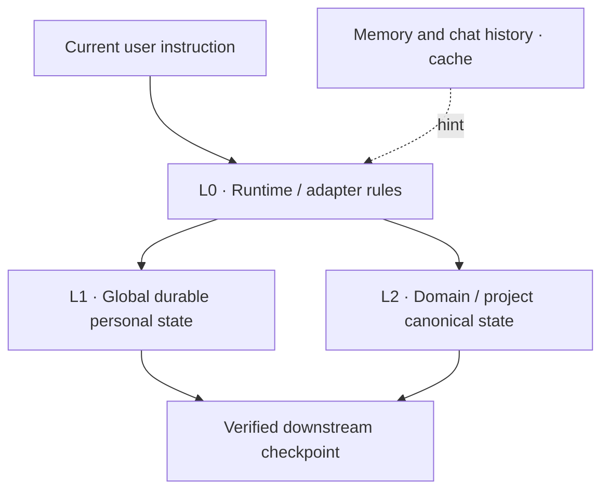

# src_you

> **Your AI needs a source of truth about you.**

[](https://github.com/focaxisdev/src_you/actions/workflows/validate.yml)
[](LICENSE)

Most AI memory systems ask: **What should the AI remember?**

`src_you` asks the governance question that appears after memory exists:

> **When memories, chats, projects, and files disagree, which state is
> authoritative now?**

`src_you` is a platform-neutral reference architecture for durable personal
state across AI conversations, projects, and agents. It defines canonical
ownership, supersession, global/project boundaries, minimal retrieval,
privacy, and explicit recovery. It is an early public reference implementation,
not a hosted service or production-proven memory product.

## Why this exists

Chat history preserves what was said. Product Memory recalls useful context.
Vector search finds similar material. A second brain accumulates knowledge.
None of those mechanisms alone establishes which value currently governs when:

- an old preference survives beside its replacement;
- a project next step is copied into a global profile and drifts;
- cached Memory conflicts with a maintained record;
- an inference is repeated until it looks like a fact;
- a newer backup is mistaken for the live source.

`src_you` treats this as **durable personal state governance**, not simply
storage or retrieval.

## What it is — and is not

The repository provides architecture, normative policies, operational prompts,
private-state templates, synthetic examples, reference adapters, acceptance
tests, and dependency-free validation tools.

It is not:

- a vector database, RAG server, chat archive, or prompt collection;
- an Obsidian replacement or a requirement to use Markdown;
- an AI clone, personality simulator, or “digital consciousness”;
- a hosted backend, sync service, or telemetry system;
- a reason to put personal data in GitHub.

The framework can be public. **Your actual personal state should be private,
user-controlled, and separate from this repository.**

## Architecture in one minute



| Layer | Owns | Must not own |
|---|---|---|
| **L0 — Runtime / adapter** | Routing, retrieval, priority, conflicts, platform mapping | Personal facts or project progress |
| **L1 — Global durable state** | Identity, durable preferences, goals, constraints, decisions, commitments, deadlines, major milestones, cross-project state, pointers | Exact next step, current question, code cell, or session handoff |
| **L2 — Domain / project state** | Specialized detailed progress, evidence, handoff, temporary blockers, and micro-state | A competing global profile |

The boundary is:

```text
PROJECT_DETAILED_STATE != GLOBAL_STATE
```

L1 may say a certification project is active, name its deadline and major phase,
and point to L2. L2 alone owns “question 17,” the temporary misconception, and
the exact next action. Changing question 17 to 18 should not require an L1 edit.

## The governance contract

1. **One canonical owner.** Every active state item has one authoritative owner
   for its scope.
2. **Memory is cache, not authority.** Memory and old chats may assist recall;
   they do not overrule maintained state.
3. **Update in place.** A durable change leaves one `current` value and marks
   the prior value `superseded` under a stable record ID.
4. **Keep L1 and L2 distinct.** Global state stores durable summaries and
   pointers; project micro-state stays local.
5. **Retrieve minimally.** Route first, then load only the scopes required for
   the task.
6. **Resolve conflicts by scope.** A current explicit instruction leads for the
   turn; the canonical owner for the relevant scope governs maintained state.
7. **Type claims.** Keep Fact, Decision, Preference, Inference, and Open Loop
   distinct. Never silently promote Inference to Fact.
8. **Revalidate external observations.** Prices, laws, jobs, product versions,
   public roles, and news are dated observations, not timeless personal facts.
9. **Keep recovery explicit.** Checkpoints and backups are downstream; a newer
   timestamp cannot appoint a new authority.
10. **Make privacy architectural.** Secrets and unnecessary raw sensitive
    evidence do not belong in durable core state.

Read [Architecture](docs/architecture.md), [Core concepts](docs/concepts.md),
and the normative [`policies/`](policies/) for the complete contract.

## Try it in five minutes

Requirements: Python 3.10 or newer. The scripts use only the standard library
and do not upload data.

```bash
git clone https://github.com/focaxisdev/src_you.git
cd src_you
python scripts/run_checks.py
python scripts/bootstrap_private_state.py ../src_you-private --dry-run
python scripts/bootstrap_private_state.py ../src_you-private
```

The bootstrap script copies an unfilled scaffold, refuses a destination inside
this public repository, and refuses to overwrite a non-empty location. It does
not ingest chats, memories, accounts, or documents.

Next:

1. keep `../src_you-private` private and access-controlled;
2. open its `00_SYSTEM_MANIFEST.md` and designate one L1 authority and writer;
3. register L2 projects by logical pointer without copying their micro-state;
4. connect a verified adapter;
5. run the fourteen behavioral acceptance scenarios with privacy-safe evidence.

Use the full [five-minute quick start](docs/quick-start.md). If you already have
a vault, memory service, or state system, begin with
[`prompts/audit-existing-system.md`](prompts/audit-existing-system.md) so you do
not create a second truth.

Want a zero-risk walkthrough first? Read the
[fictional learning example](examples/fictional-learning/global-state.md) beside
its [L2 project state](examples/fictional-learning/project-state.md), then inspect
the [supersession example](examples/conflict-resolution-example.md).

## Reference adapters

Adapters keep product behavior replaceable:

- [`adapters/chatgpt/`](adapters/chatgpt/) maps ChatGPT instructions, projects,
  files/sources, and Memory.
- [`adapters/codex/`](adapters/codex/) maps layered `AGENTS.md` guidance, local
  project files, authorized filesystem state, and local Codex Memory.

Both are capability-aware and dated. Product features can change; core
canonical-state semantics should not. Read the
[adapter contribution guide](adapters/README.md) before proposing another one.

## Privacy model

| Asset | Default visibility | Role |
|---|---|---|
| Framework repository | Public or private | Reusable rules, examples, and tooling |
| L1 canonical personal state | **Private** | Current global durable state |
| L2 canonical project state | Private or narrowly project-scoped | Detailed domain and project state |
| Checkpoints and history | **Private** | Recovery only |

Never store passwords, tokens, cookies, private keys, OTPs, full payment
credentials, or unnecessary raw confidential documents in core state. Prefer a
minimum durable summary and safe logical pointer. Read
[Privacy and security](docs/privacy-and-security.md) before using real data.

## Validation and conformance

Run every public-repository gate:

```bash
python scripts/run_checks.py
```

Or run the component commands listed in [CONTRIBUTING.md](CONTRIBUTING.md).
CI runs the same gates on Linux and Windows for every push and pull request.

Repository checks validate structure, strict UTF-8, internal links, high-signal
sensitive patterns, synthetic fixtures, safe scaffolding, and checkpoint
integrity. They also verify the public social-preview dimensions, checksums, and
absence of embedded text/EXIF metadata. They cannot prove that a private
implementation behaves correctly.
Implementation conformance requires evidence for all fourteen scenarios in
[`tests/acceptance-tests.md`](tests/acceptance-tests.md), including routing,
supersession, conflict resolution, privacy, recovery, Inference handling, and
platform portability.

## Repository map

```text
docs/                 Architecture, quick start, roadmap, and design rationale
policies/             Normative retrieval, update, conflict, privacy, and recovery rules
prompts/              Bootstrap, audit, normalize, checkpoint, restore, and upgrade workflows
templates/src_you/    Private-state scaffold to copy into a controlled store
adapters/             Replaceable platform capability mappings
examples/             Synthetic demonstrations only
tests/                Behavioral acceptance contract and synthetic fixtures
scripts/              Small standard-library validation and bootstrap tools
```

## Related work and the wedge

`src_you` is complementary to persistent wikis, agent-memory runtimes, context
databases, portable identity specifications, and second-brain tools. Those
systems may store, compile, retrieve, or synchronize valuable context.

The narrower wedge is authority:

> Memory asks what to recall. `src_you` asks which maintained state should win
> when recall and state sources disagree.

See the current, non-antagonistic [related-work analysis](docs/related-work.md).

## Status and roadmap

**Current release line: v0.1.x — early public reference implementation.**

The next milestone is not a larger feature surface. It is implementation
feedback: evidence that different private stores and AI platforms preserve the
same ownership, supersession, routing, privacy, and recovery semantics.

See the [Now / Next / Later / Research roadmap](docs/roadmap.md) and the
[implementation report guide](docs/implementation-reports.md).

## Contributing, security, and license

Contributions are welcome. Start with [CONTRIBUTING.md](CONTRIBUTING.md), keep
examples synthetic, and explain which invariant a change preserves. For a
suspected privacy leak or vulnerability, follow [SECURITY.md](SECURITY.md) and
do not put sensitive evidence in a public issue.

Maintainers should use the [release process](docs/release-process.md) before
creating or promoting a tag.

Licensed under the [MIT License](LICENSE).
