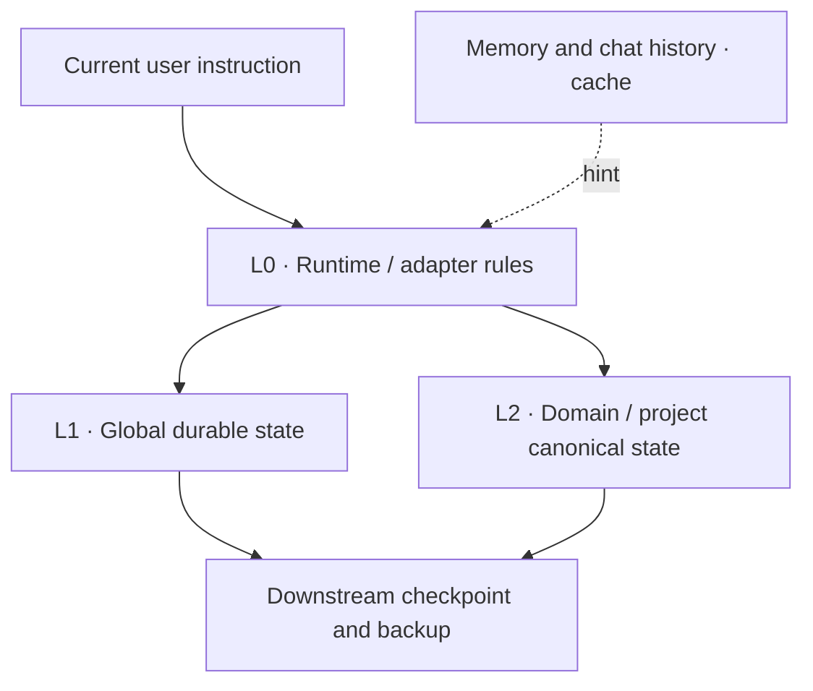
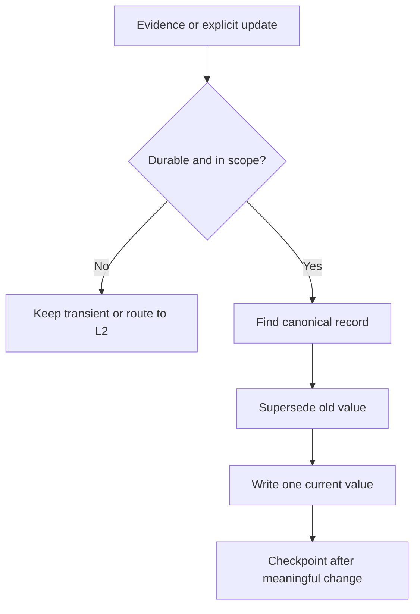

# src_you

> **A source of truth for every AI that works with you.**

Your AI needs a source of truth about you.

Chat history is not you. Memory is not you. A stale profile is not you. `src_you`
is an open architecture for maintaining the durable personal state that currently
holds—and for giving conversations, projects, agents, and future AI platforms a
clear way to retrieve it without inventing a second truth.

`src_you` is a framework, not a hosted service. This repository contains the
architecture, policies, prompts, templates, fictional examples, and validation
tools needed to build your own private implementation.

## The problem

AI products remember fragments. Chats preserve history. Projects preserve local
working context. None of those mechanisms automatically answers the harder
question:

> When two sources disagree, which version should the AI believe now?

Without explicit ownership and lifecycle rules, personal context drifts:

- an old preference remains active beside its replacement;
- a global profile duplicates a project's rapidly changing next step;
- cached memory silently outranks a maintained source;
- a newer backup timestamp is mistaken for authority;
- an inference becomes a fact because nobody recorded its status.

`src_you` treats this as a **state-governance problem**, not merely a storage or
retrieval problem.

## What `src_you` is—and is not

`src_you` is a platform-neutral reference framework for **durable personal
state**: identity, durable preferences, goals, constraints, decisions,
commitments, deadlines, major milestones, high-level project status,
cross-project relationships, unresolved open loops, and pointers to detailed
canonical state.

It is not:

- a replacement for product memory;
- a chat archive or prompt collection;
- an Obsidian vault template, vector database, or RAG server;
- an AI clone, consciousness copy, or personality simulator;
- a requirement to put personal data in GitHub—or anywhere public.

The framework can be open. **Your personal state should remain under your
control.**

## Architecture in one minute



| Layer | Owns | Must not own |
|---|---|---|
| **L0 — Runtime / adapter rules** | Routing, retrieval, priority, conflict handling, runtime integration | Personal facts or project progress |
| **L1 — Global durable personal state** | Cross-domain state, durable decisions, major milestones, canonical pointers | Exact question number, next code cell, temporary handoff |
| **L2 — Domain / project canonical state** | Detailed project, learning, and workflow state | A competing global profile |

The central boundary is:

```text
PROJECT_DETAILED_STATE != GLOBAL_STATE
```

If a learning project is preparing for a December exam, L1 may hold the goal,
deadline, major phase, and a pointer. L2 may hold “question 17,” a temporary
precision/recall misconception, and “next: question 18.” Copying those L2 details
into L1 creates two writers and eventual divergence.

## Core principles

1. **One authoritative source.** Every active state item has one canonical owner.
2. **Memory is cache, not authority.** Memory and old chats may help retrieval;
   they do not overrule maintained state.
3. **Durable state only.** Promote information only when it should survive the
   session.
4. **Project detail stays in L2.** L1 stores the project summary and pointer, not
   its micro-progress.
5. **Update in place.** A changed state becomes `current`; the old state becomes
   `superseded`, never simultaneously active.
6. **Retrieve minimally.** Load only the domains and detail layer required by the
   question.
7. **Resolve conflicts by scope and source.** Current explicit instructions lead;
   the canonical owner for the relevant scope follows.
8. **Type every claim.** Distinguish Fact, Decision, Preference, Inference, and
   Open Loop.
9. **Revalidate changing external facts.** Prices, laws, jobs, product versions,
   officeholders, and news are observations with dates—not permanent truths.
10. **Backups stay downstream.** Restore is explicit and controlled; “newest
    timestamp wins” is forbidden.
11. **Privacy is architectural.** Public framework and private personal state are
    separate systems.
12. **Adapters are replaceable.** ChatGPT is the first reference adapter, not a
    permanent platform dependency.

See [Architecture](docs/architecture.md) and [Core concepts](docs/concepts.md)
for the complete model.

## How state changes



Example:

```yaml
id: PREF-WORK-001
type: Preference
status: current
statement: "Prefer remote-first roles."
effective_from: 2026-08-20
supersedes: "Prefer office-first roles."
```

The previous value remains history, but only one value is active.

## Quick start

> **Do not put real personal state in a public fork.** Keep this framework repo
> public if you wish; create the actual state tree in a private, user-controlled
> location.

1. Fork or download this framework.
2. Choose one private authoritative store that your AI can read and update.
3. Open [`prompts/bootstrap.md`](prompts/bootstrap.md), fill the short
   configuration block, and paste the complete prompt into a capable AI work
   session.
4. Let the agent inspect the environment, detect existing systems, create the
   smallest viable structure, and run acceptance tests.
5. Perform only the manual actions the agent reports as genuine platform or
   authorization boundaries.

The bootstrap follows **AUTOMATE FIRST, ASK USER LAST**. It explicitly forbids
creating a duplicate system when a usable one already exists.

If you already have a second brain, vault, memory service, or custom state
system, start with
[`prompts/audit-existing-system.md`](prompts/audit-existing-system.md) instead.

## ChatGPT reference adapter

[`adapters/chatgpt/`](adapters/chatgpt/) maps the platform-neutral layers to
current ChatGPT concepts:

- runtime rules → custom instructions, project instructions, or equivalent
  instruction files;
- L1 durable state → a private canonical file collection, such as ChatGPT
  Library when available;
- L2 detailed state → project-specific files and sources;
- Memory → semantic recall cache;
- backup → downstream Drive/Git-style checkpoints.

Product names and capabilities can change, so the adapter is capability-aware
and dated. The core architecture does not depend on any ChatGPT UI label.

## Privacy model

`src_you` separates four things that are often accidentally mixed:

| Asset | Expected visibility | Role |
|---|---|---|
| Framework repository | Public or private | Reusable rules and templates |
| Canonical personal state | Private by default | Current authoritative state |
| Project canonical state | Private or project-scoped | Detailed L2 state |
| Backups and version history | Private by default | Recovery only |

Never store passwords, tokens, private keys, OTPs, full payment credentials, or
raw confidential documents in core state. Store the minimum durable summary and
a safe pointer when a sensitive source must remain elsewhere. Read
[Privacy and security](docs/privacy-and-security.md) before using real data.

## Repository map

```text
docs/                 Architecture and design rationale
policies/             Normative retrieval, update, conflict, privacy, and backup rules
prompts/              Bootstrap, audit, normalize, checkpoint, restore, and upgrade workflows
templates/src_you/    Private-state scaffold to copy into a controlled store
adapters/chatgpt/     First platform reference adapter
examples/             Synthetic demonstrations only
tests/                Human-readable acceptance contract and fixtures
scripts/              Small standard-library validation tools
```

Run all local validation gates:

```bash
python scripts/validate_structure.py
python scripts/check_internal_links.py
python scripts/scan_sensitive_placeholders.py
python scripts/checkpoint_manifest.py self-test
```

The scripts do not upload data and have no third-party dependencies.

## Related work

`src_you` is adjacent to several valuable approaches:

- [Karpathy's LLM Wiki](https://gist.github.com/karpathy/442a6bf555914893e9891c11519de94f)
  focuses on incrementally compiling sources into a maintained knowledge wiki.
- [Open Second Brain](https://github.com/itechmeat/open-second-brain) provides an
  Obsidian-native memory layer and deterministic agent integrations.
- [OpenViking](https://github.com/volcengine/OpenViking) is a hierarchical
  context database for agent memory, resources, and skills.
- [ai-memory](https://github.com/akitaonrails/ai-memory) supports long-term coding
  agent memory and cross-vendor handoff.
- [Second Brain on Cloudflare](https://github.com/rahilp/second-brain-cloudflare)
  offers a shared, self-hosted memory service across AI clients.
- [Soul Protocol](https://github.com/luishg/soul-protocol) explores portable AI
  assistant identity and context.

`src_you` does not try to replace these systems. Its narrower focus is the
governance of **canonical personal state**: supersession, global/project
boundaries, minimal retrieval, scope-aware priority, portable adapters, and
one-directional recovery. See the full [related-work analysis](docs/related-work.md).

## Project status and roadmap

**Current version: v0.1.0 — early public reference implementation.**

The architecture, bootstrap prompt, templates, policies, fictional examples,
and acceptance contract are usable. Planned work:

- gather implementation reports from different storage backends;
- add reference adapters for additional AI platforms;
- formalize a machine-readable state schema without making it mandatory;
- add conformance fixtures for adapter maintainers;
- improve migration guidance from common vault and memory layouts.

Roadmap items are proposals, not commitments. Open an issue before adding a
runtime, database, or hosted service: the core should remain small and
platform-neutral.

## Contributing and security

Contributions are welcome. Start with [CONTRIBUTING.md](CONTRIBUTING.md), and
keep examples fictional and de-identified. For suspected vulnerabilities or
privacy leaks, follow [SECURITY.md](SECURITY.md) rather than opening a public
issue containing sensitive details.

## License

MIT. See [LICENSE](LICENSE).
