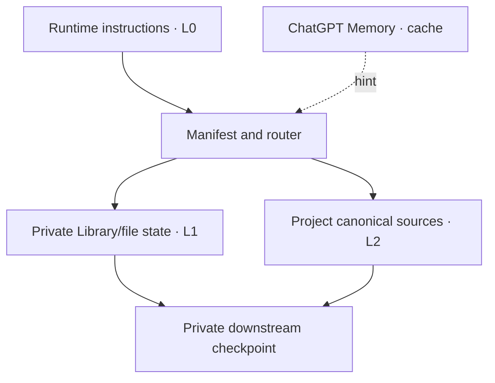

# ChatGPT reference adapter

This adapter maps `src_you` to current ChatGPT capabilities while keeping the
core platform-neutral.

## Mapping

| src_you role | ChatGPT-oriented mapping |
|---|---|
| L0 runtime rules | Custom instructions, project instructions, checked-in `AGENTS.md`, or an equivalent instruction layer available on the current surface |
| L1 global durable state | A private canonical file set, such as ChatGPT Library when the account and tools expose a persistent file library |
| L2 project detailed state | ChatGPT Project sources/instructions or project-local canonical files |
| Memory | Helpful semantic recall cache; never the only source for rules or current canonical state |
| Checkpoint / backup | Explicit export or copy from canonical files to a private downstream store and version history |

The mapping is capability-based. ChatGPT web, desktop, Work, Codex CLI, and IDE
surfaces do not expose identical storage or instruction mechanisms. Probe the
current environment before choosing a path.

## Official capability basis

Official OpenAI documentation currently says:

- [Memories](https://learn.chatgpt.com/docs/customization/memories) carry useful
  context forward, while required guidance should remain in instructions or
  checked-in documentation.
- [Projects and chats](https://learn.chatgpt.com/docs/projects) keep related
  chats, files, instructions, and sources together; project instructions apply
  across project chats.
- [Personalize ChatGPT](https://learn.chatgpt.com/docs/personalize) documents
  custom instructions and separates them from Memory.
- The [plugin file reference](https://developers.openai.com/plugins/reference#file-apis)
  describes the ChatGPT file library as optional, so an implementation must
  feature-detect it rather than assume universal availability.

Capability observations were checked on **2026-08-20**. Reverify them before
changing an implementation; product UI and availability can change.

## Recommended deployment pattern

1. Keep the L0 bootstrap concise and point it to the manifest.
2. Use a private persistent file collection for L1 when available.
3. Give each specialized project an L2 canonical source.
4. Store only the L2 pointer and high-level phase in L1.
5. Treat Memory as a recall aid and repair stale cached claims when detected.
6. Make every checkpoint and restore explicit.

## Files

- [`runtime-instructions.md`](runtime-instructions.md) — compact L0 instruction
  block.
- [`project-integration.md`](project-integration.md) — L1/L2 routing and project
  setup.
- [`capability-notes.md`](capability-notes.md) — probe checklist, current
  observations, and limitations.

Use [`../../prompts/bootstrap.md`](../../prompts/bootstrap.md) for full setup.
