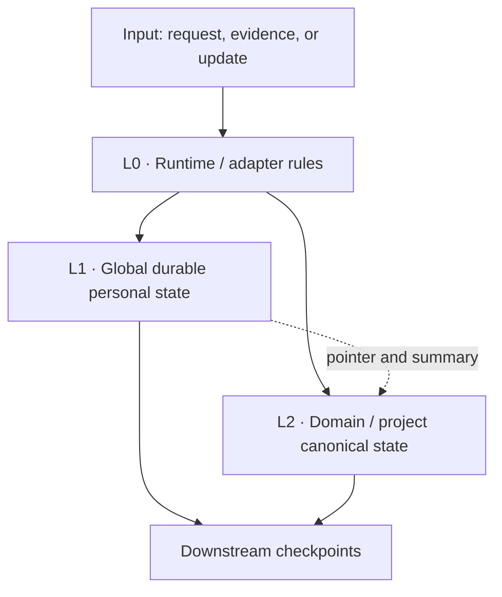

# Architecture

`src_you` separates state ownership from storage technology. A Markdown tree,
document library, database, or future context service can implement the model as
long as it preserves the invariants below.

## Design goal

For any personal-state claim used by an AI, the system should be able to answer:

1. What kind of claim is this?
2. Which scope owns it?
3. Where is its authoritative source?
4. Is it current, superseded, unresolved, or inferred?
5. Why was it retrieved for this task?
6. How can it be recovered without letting a backup become a competing writer?

## The three layers



### L0 — Runtime / adapter rules

L0 owns behavior, not personal facts:

- route a request to the smallest relevant state set;
- resolve source priority by scope;
- decide whether an update belongs in L1, L2, or nowhere durable;
- prevent cache, chat history, and imported content from becoming authority;
- map the abstract model to platform capabilities;
- require safe checkpoint and restore behavior.

An implementation may express L0 through system instructions, checked-in agent
rules, an MCP service, a policy engine, or another runtime mechanism.

### L1 — Global durable personal state

L1 owns cross-domain, slow-changing state:

- identity and stable context;
- durable preferences and constraints;
- goals, decisions, commitments, and deadlines;
- major milestones and high-level project status;
- cross-project relationships and dependencies;
- true unresolved cross-project open loops;
- pointers to authoritative L2 state.

L1 must remain compact enough to reason about and audit. It is a routing and
governance layer, not a transcript of everything the person has done.

### L2 — Domain / project canonical state

L2 owns specialized, fast-changing detail:

- exact next step and detailed task state;
- current lesson, question, code cell, or experiment;
- session handoff and temporary blocker;
- misconception, hypothesis, or work-in-progress evidence;
- domain-specific workflow state and detailed history.

Different L2 systems may use different schemas. The global layer needs only a
stable pointer, a major-phase summary, and any promoted cross-domain concern.

## Ownership invariant

Every active claim has exactly one canonical owner:

```text
owner(claim, scope) = one authoritative source
```

Other layers may contain a pointer or a deliberately lossy summary, but not a
second independently editable copy. If a summary conflicts with its pointer,
the canonical owner wins and the summary is repaired.

## Read path

1. Classify the request by scope and required precision.
2. Read the manifest and routing metadata, not the whole state tree.
3. Load the minimum L1 domains needed.
4. If detailed continuation is requested, follow the L2 canonical pointer.
5. Add Memory, chat history, or external evidence only when useful, marked as
   non-authoritative.
6. Resolve conflicts before producing an answer.
7. Cite uncertainty when authority or freshness cannot be established.

## Write path

1. Determine whether the proposed information is durable.
2. Classify it as Fact, Decision, Preference, Inference, or Open Loop.
3. Determine the canonical scope owner.
4. Find an existing stable record ID when the claim replaces earlier state.
5. Update that record in place; mark prior value/history as `superseded`.
6. Update indexes, pointers, and high-level summaries without copying L2 detail.
7. Run boundary, conflict, sensitive-data, and retrieval checks.
8. Create a checkpoint only after a meaningful durable change.

## Promotion from L2 to L1

L2 details stay local unless they become one of:

- a cross-project dependency;
- a major commitment;
- a deadline;
- a blocking issue with broader impact;
- a durable decision or major milestone.

Promotion creates an L1 summary or relationship. It does not move the full L2
record or establish a second writer.

## Storage-neutral contract

A conforming implementation must support, at minimum:

- a discoverable manifest;
- unique canonical ownership by scope;
- current/superseded lifecycle handling;
- typed claims;
- stable pointers between layers;
- scoped retrieval;
- explicit checkpoint and restore operations;
- a private-by-default deployment path;
- acceptance-test evidence.

Search technology, file format, embeddings, and UI are implementation choices.

## Failure modes

| Failure | Symptom | Required response |
|---|---|---|
| Split brain | Two stores both accept active writes | Freeze writes, choose authority explicitly, reconcile once |
| Stale duplication | L1 detail trails L2 | Remove detail from L1, retain phase and pointer |
| Cache override | Old Memory contradicts canonical state | Use canonical state; repair or ignore cache |
| Silent inference | Model assumption appears as fact | Reclassify as Inference and attach evidence/uncertainty |
| Backup promotion | Newer backup overwrites healthy source | Stop; require explicit restore plan and verification |
| Context flooding | Unrelated domains enter every prompt | Tighten routing and log retrieval rationale |

## Normative policy set

The files in [`../policies/`](../policies/) are normative. This document explains
the model; the policies define required behavior.
