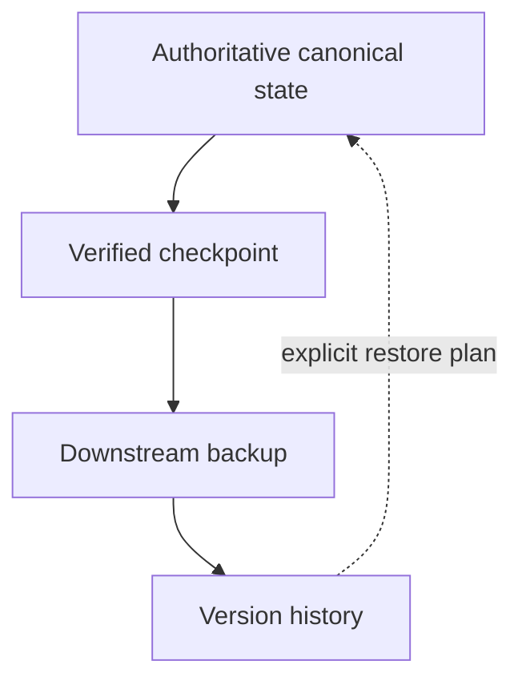

# Backup and recovery

Backups protect authoritative state; they do not become authoritative state.



## Checkpoint contract

A checkpoint should contain:

- a version or restore-point label;
- an ISO 8601 timestamp with timezone;
- the authoritative-source identity and scope;
- a sorted file inventory;
- byte sizes and SHA-256 hashes;
- policy/schema version;
- a description of the meaningful durable change;
- excluded paths and the reason for exclusion;
- integrity-verification result.

Create checkpoints after meaningful durable change, not after every chat. High
frequency without semantic value creates noise and may preserve transient data.

## One-way flow

Normal operation is:

```text
AUTHORITATIVE SOURCE
    -> checkpoint
    -> backup
    -> version history
```

Forbidden normal behavior:

- bidirectional synchronization of competing writers;
- automatic overwrite from backup to canonical state;
- selecting authority by newest timestamp;
- silently merging edits made directly in a backup;
- restoring without integrity and privacy review.

## Restore protocol

1. Declare a recovery operation and freeze normal writes.
2. Identify the damaged canonical scope and intended restore point.
3. Verify checkpoint inventory and hashes.
4. Inspect the checkpoint for secrets, private-scope mismatch, and stale schema.
5. Compare checkpoint state to the damaged source; document intended changes.
6. Restore into a staging location or new version when the platform allows.
7. Run acceptance tests and targeted semantic checks.
8. Explicitly promote the recovered result as the canonical source.
9. Resume writes and create a post-restore checkpoint.
10. Record the operation without copying sensitive contents into the log.

Use [`../prompts/checkpoint.md`](../prompts/checkpoint.md) and
[`../prompts/restore.md`](../prompts/restore.md). The optional
[`checkpoint_manifest.py`](../scripts/checkpoint_manifest.py) creates and
verifies deterministic local inventories.
